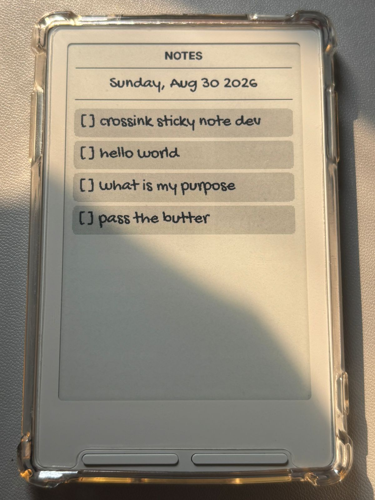

> **This is a personal fork of [CrossInk](https://github.com/uxjulia/CrossInk)**, which itself is based on [CrossPoint Reader](https://github.com/crosspoint-reader/crosspoint-reader).
>
> This fork keeps the existing CrossInk reading experience while adding a few personal workflow and UI changes. The main addition is **Sticky Notes support for the Xteink X3/X4**.
>
> **Sticky Notes is still under development.** At the moment, notes can only be received through **ESP-NOW**.

### Supported Devices

- Xteink X3
- Xteink X4

## What's different in this fork

The main goal of this fork is to add a small productivity layer to CrossInk without changing its core reading experience.

### Sticky Notes

  

- Added **Sticky Notes** support to Xteink X3/X4.
- Notes are currently received through **ESP-NOW**.
- Any ESP32 can send notes using the documented [Sticky Notes ESP-NOW protocol](./docs/sticky-notes-esp-now-sender.md); BrokenSignal-Pro is not required.
- Received notes can be saved as the device's persistent sleep-screen note.
- On the `Minimal` / `Dashboard` home layout, Sticky Notes can be accessed directly from the front-button shortcuts, while file browsing remains available from the Menu.
- Additional input methods may be added as the feature develops.
